# Point-Voxel Reading Notes 2023/09

⭐ This note is a quick glance on the articles published BEFORE 2023.

❗The latest articles about point&voxel model is on processing of reading... 🥲🥲

❤️ For CS8813 Only.

## Based on lidar point clouds

### Point-based

#### [PointRCNN](https://github.com/sshaoshuai/PointRCNN)

Based on the Point series of 3D point cloud detectors generally detect sampling point by point, PointRCNN is a classic article in the field, based on the original dense point cloud data directly perform feature extraction and RPN operations. This paper uses PointNet++ network to achieve foreground and background segmentation, which is mainly divided into two stages. The first stage generates a large number of redundant bounding boxes. First, for the semantic segmentation of the point cloud, for each point to a prediction label, such as now: for all points that are judged to be "cars" (also called foresight), give label=1, and other points (also called background points) give label=0. Then, a bounding box is generated with all the former attractions, and one former attraction corresponds to a bounding box, but the semantic segmentation results must be accurate. Using some redundancies, the authors continue to reduce the number of bounding boxes, leaving only 300 bounding boxes at the end of this phase. The second phase continues to optimize the bounding box generated in the previous phase. First, rotate and translate the bounding boxes generated in the previous stage to convert these bounding boxes to their own canonical coordinates. Then, through point cloud pooling and other operations to the characteristics of each bounding box, and then combined with the characteristics of the first stage, the bounding box correction and confidence score are carried out, so as to reach the final bounding box. The network structure is shown below (the result is also the SOTA of the year!). )：

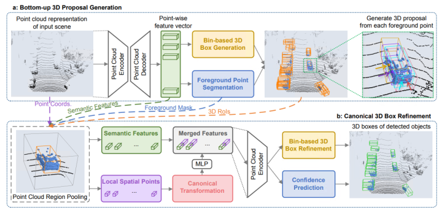

#### [3DSSD](https://github.com/dvlab-research/3DSSD)

The authors of 3DSSD propose a two-stage 3D detection method based on the original point cloud like PointRCNN, which often uses the Set Abstraction layer (SA) for continuous downsampling, grouping and feature extraction in the first stage, and then uses the Feature Propagation layer (FP) to continuously upsample and feature propagation of the SA output. After obtaining the foresight using semantic segmentation, these methods are proposed to 3D detect the frame centered on each pre-attraction (the rough proposal of the first stage). After the rough proposal is completed, the internal points of these rough proposal detection frames are extracted and processed to fine-tune the detection frame to obtain a more accurate detection frame (the second stage of refining process). However, the FP layer and refining process in the two-stage method described above tend to consume more than half the time during the model forward inference. Is it feasible to simply remove these modules (only the SA layer remains) and then directly make a single-stage proposal based on the features extracted by SA? It turns out that someone did, but this simple and straightforward method resulted in a lot less accurate detection. Possible reasons for this are that some existing methods use the D-FPS method (distance-based farthest point sampling method) in the downsampling step of the SA layer. The characteristics of this sampling method are: based on the principle of the largest spatial distance, the point cloud of the sampling scene is continuously iterative, and the sampled point cloud basically covers the entire scene (avoiding the preference of random sampling for point cloud clusters with higher density). Because there are a large number of background points in the scene and there are fewer foresights in some farther targets, this sampling method filters out almost all foresights of objects that are farther away. The front attractions are filtered, and the detection accuracy will naturally not be high. Therefore, the authors hope to have a sampling method so that the sampled points (written as representative points) can not only cover the entire sampling space, but also contain as many foresights as possible, that is, the F-FPS in the paper. 3DSSD, which achieves a good balance between accuracy and efficiency, is nearly 1 times faster than the previous point-based detection algorithm, and also surpasses all single-stage voxel-based methods at that time.

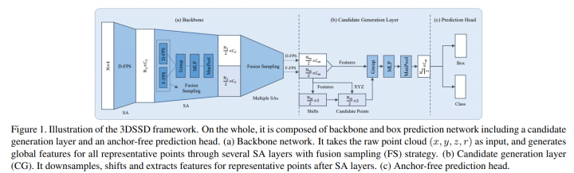
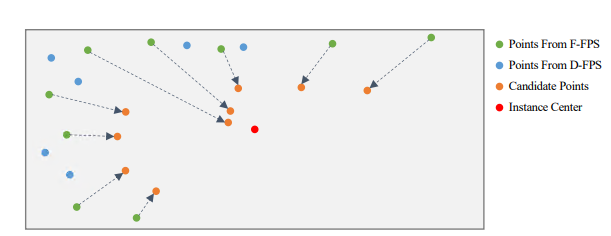

#### [Fast PointRCNN](https://arxiv.org/abs/1908.02990)

Fast PointRCNN is an improved version of PointRCNN, but a point-voxel detector (for convenience here first), PointRCNN is too slow in the first phase, again foreground splitting, and another RPN return of the former attraction. Fast PointRCNN authors directly use Voxel-based data processing to structure the point cloud, and then use the stacking of three-dimensional convolution and two-dimensional convolution to extract Voxel features. (Full three-dimensional convolution can retain information on the Z axis, but it will be less efficient because of the large amount of computation.) Full two-dimensional convolution directly ignores the information of the Z axis, although the speed is fast, but the accuracy is also affected. Therefore, the author adopts this network structure of "three-dimensional convolution-two-dimensional convolution", first uses "three-dimensional convolution" to retain Z-axis information, and then uses "two-dimensional convolution" for feature extraction in order to improve efficiency. Experiments have shown that this method can indeed improve efficiency, and the accuracy will not decrease. In image-based 2D object detection tasks, the network structure of the feature pyramid (FPN) is often used to implement proposals for objects of different sizes. A feature of YOLO V3 is that in three feature maps of different scales, preset box Anchors are placed to detect objects of different sizes. The characteristics of the bottom layer are small because the sensing field is small, responsible for the detection of small objects, so a smaller anchor is placed. Conversely, the feature of the top layer is responsible for the detection task of large objects due to the large receptive field, so a larger Anchor is placed. Inspired by this, the authors of FastPointRCNN also chose this method to achieve simultaneous detection of objects of different sizes, and proposed a network called VoxelRPN, which implements the first stage of the candidate box rough proposal. After the first stage completes the proposal, then introduce RefinerNet to complete the second stage of optimization! The network process is shown in the following figure:

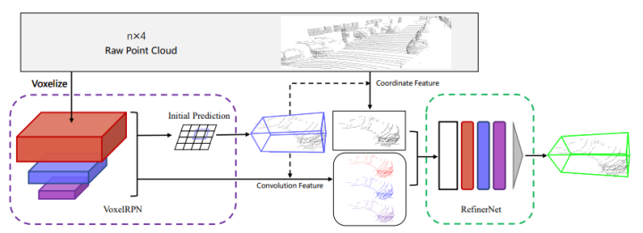

#### [Lidar RCNN](https://github.com/tusen-ai/LiDAR_RCNN)

The Lidar RCNN is a two-stage detector that can often improve any existing 3D detector (no re-training required). In order to meet the requirements of real-time and high accuracy in practice, the paper adopts the point-based method instead of the popular Voxel-based method. But the paper found an overlooked problem in previous work: naively applying PointNet-based point-based methods may make learned features ignore the scale of proposals. To this end, the paper analyzes this problem in detail and proposes several remedies to bring significant performance improvements.

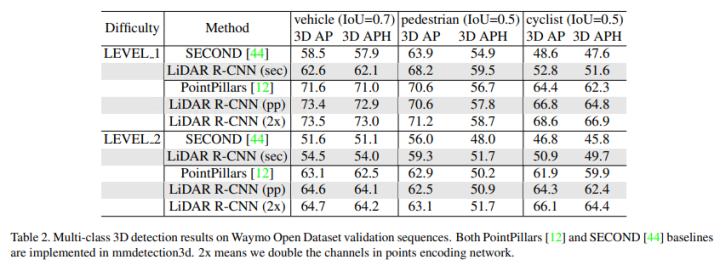
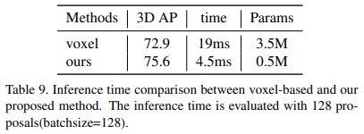

#### [IA-SSD](https://github.com/yifanzhang713/IA-SSD)

IA-SSD is the latest network proposed by CVPR2022, the paper studies the effective object detection problem of 3D lidar point cloud, in order to reduce memory and computing costs, existing point-based pipelines usually use task-independent random sampling or farthest point sampling to gradually downsample the input pointset, but not all points are equally important for object detection tasks. For Detector, the foresight is inherently more important than the background point. Based on this, this paper proposes an efficient single-stage point-based 2080D object detector called IA-SSD. IA-SSDs utilize two learnable, task-oriented, instance-aware downsampling strategies to hierarchically select foresights belonging to objects of interest. In addition, the contextual centroid sensing module is introduced to further estimate the precise instance center. Finally, in order to improve efficiency, the paper builds IA-SSD according to the pure encoder architecture. Experiments on multiple large-scale detection benckmarks demonstrated the advantages of IA-SSDs. Due to the low memory footprint and high degree of parallelism, a single RTX80Ti GPU achieves speeds of more than <> frames per second on the KITTI dataset.

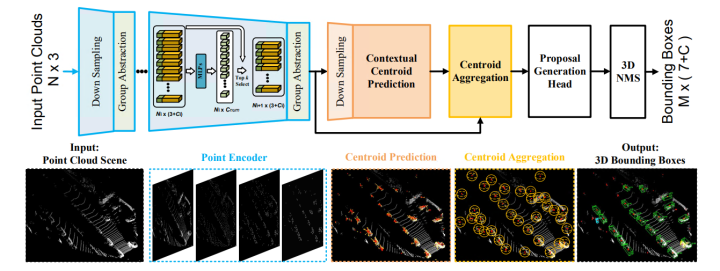

### Based on Voxel

#### [Voxel Net](https://arxiv.org/abs/1711.06396)

Voxel-based methods are hot spots in field research, and there have been many papers in recent years, VoxelNet is a pioneering work, Apple proposed! The paper divides the three-dimensional point cloud into a certain number of Voxel, and after random sampling and normalization of points, each non-empty Voxel uses several VFE (Voxel Feature Encoding) layers for local feature extraction to obtain Voxel-wise Feature, and then further abstracts the features through 3D Convolutional Middle Layers (increasing the receptive field and learning the geometric spatial representation). Finally, RPN (Region Proposal Network) is used to classify and detect objects and regress their positions. The entire VoxelNet pipeline is shown in the following figure:

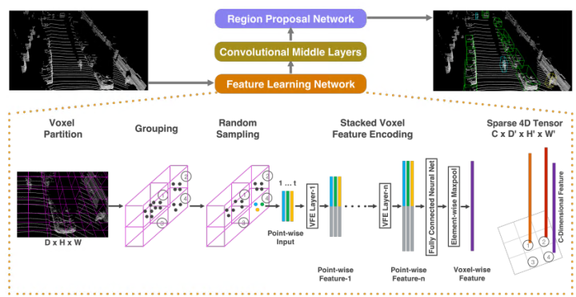

#### [SECOND](https://github.com/traveller59/second.pytorch/tree/master)

VoxelNet has a better idea, but not much advantage in speed! The full name of SECOND is Sparsely Embedded Convolutional Detection, that is, sparse convolution, the emergence of SECOND, let the real-time detection one step closer! Considering that VoxelNet obtains sparse four-dimensional tensors after passing the Feature Learning Network, and using 3D convolution to directly convolulate these four-dimensional tensors does consume computing resources, SECOND, as an upgraded version of VoxelNet, replaces ordinary 3D convolution with sparse 3D convolution, as shown in the figure below.

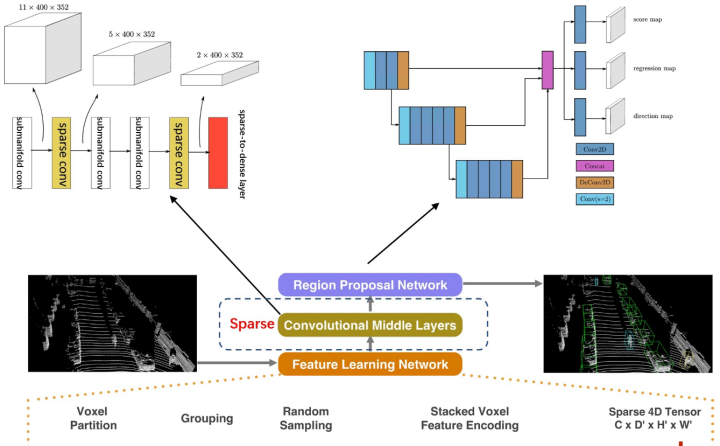

#### [PointPillars](https://github.com/zhulf0804/PointPillars)

PointPillars is a paper from the industry in 2019, which is of great significance, the most important feature of the model is the balance of detection speed and accuracy, the average detection speed reaches 62Hz, the fastest speed reaches 105Hz, far ahead of other models (and the current landing of more solutions). A new point cloud coding method is proposed to extract point cloud features for PointNet, and then map the extracted features into 2D pseudo-images for 2D target detection by 3D target detection. Despite using only lidar, PointPillars significantly outperforms the latest technology in terms of 3D and bird's-eye KITTI benchmarks, and even in fusion methods, with the model structure shown in the following diagram:

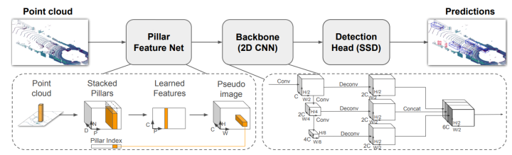

#### [Part-A2](https://github.com/sshaoshuai/PartA2-Net)

Part-A2 extends PointRCNN to a new and powerful point cloud-based 2D object detection framework, the Part Sensing and Aggregation Neural Network (part-A3 network), which consists of a part awareness phase and a part aggregation phase. The part perception stage uses the information provided by 3D GT bbox to generate annotation information for 3D segmentation, dividing the pre-attractions and background points; For all former attractions, estimate the relative position of each former attraction (intra-object part location, think that this information implicitly encodes the shape of the 3D target); Generate 3D proposals from the original point cloud (both anchor-free and anchor-based). In the component aggregation stage, for different proposals may have the same point cloud information, resulting in the same characteristics of the problem of ambiguity, the paper proposes an ROI-aware point cloud pooling scheme, which retains all the information of non-empty and empty voxels to eliminate the ambiguity of the point cloud pooling scheme. The geometric information of the bbox is encoded by empty voxels to improve the performance of the re-score and position refinement of the bbox. In addition, sparse convolution and sparse pooling operations are further used to gradually aggregate the pooled part features of each 2D proposals to achieve accurate prediction. The Part-A3 network outperforms all 3D detection methods of the year (using only lidar point cloud data), and implements SOTA on the KITTI <>D target detection dataset.

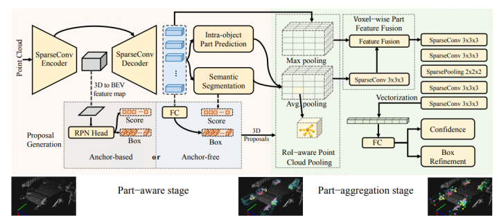

#### [CIA-SSD](https://github.com/Vegeta2020/CIA-SSD)

This article proposes a voxel-based one-stage object detection model based on SECOND for Backbone, and its basic idea is to calibrate the two tasks of classification and localization in single-step object detection, and proposes Confident IoU-Aware Single-Stage Object Detector (CIA-SSD). The first is the Spatial-Semantic Feature Aggregation (SSFA) module, which adaptively fuses low-end spatial features and high-end abstract semantic features in order to accurately predict target boxes and classification confidences. The second is the IoU-aware confidence rectification module, which is further calibrated to make it more consistent with positioning accuracy. Finally, Distance-variant IoU-weighted NMS is used to obtain smoother regression and avoid redundant predictions.

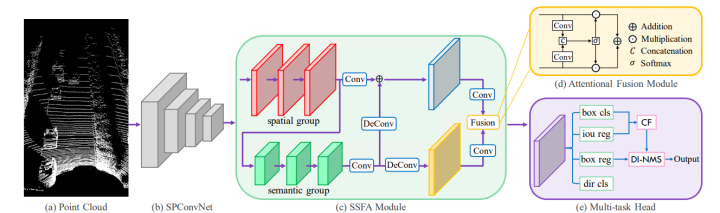

#### [SE-SSD](https://github.com/Vegeta2020/SE-SSD)

SE-SSD proposes the Self-Ensembling single-stage Object Detector (SE-SSD) for precise detection in outdoor point clouds, focusing on using soft (predicted by the teacher model) and hard (annotated information) goals and formulated constraints to jointly optimize the model, without introducing additional computation into inference. Specifically, SE-SSD consists of a pair of teacher and student SSDs, and designs an effective IOU-based matching strategy to filter the soft targets of the teacher and a consistency loss to align the student's predictions with them. In addition, in order to maximize the distillation knowledge of the teacher, a new data augmentation scheme is designed to generate shape-aware augmented samples to train the student SSD to infer the complete target shape. Finally, in order to make better use of the hard target, an ODIoU loss is also designed to supervise the student of the box center and direction of the constraint prediction at speeds up to 30.56ms.

#### [Voxel-RCNN](https://github.com/djiajunustc/Voxel-R-CNN)

Voxel-RCNN pointed out that the general point-based accuracy is high but the feature calculation is large, and the voxel-based structure is more suitable for feature extraction, but the accuracy is reduced. The authors believe that the precise positioning of point cloud data is not required, and that coarse Voxel granularity can also produce sufficient detection accuracy. The Voxel R-CNN proposed in the paper is a two-step method, which still achieves comparable detection performance with current point-based methods, but the amount of computation is reduced. The Voxel R-CNN mainly includes a 3D backbone network, a 2D BEV RPN and an inspection head, in which the proposed voxel ROI pooling is responsible for extracting ROI features from voxel features. As shown in the figure below, 3D features are extracted through 3D backbone, then mapped to BEV space, proposals are generated, and features are extracted through Voxel ROI Pooling for optimization. Compared to existing voxel-based methods, the Voxel R-CNN offers higher detection accuracy while maintaining a real-time frame processing rate of 2080 on the NVIDIA RTX 25 Ti GPU!

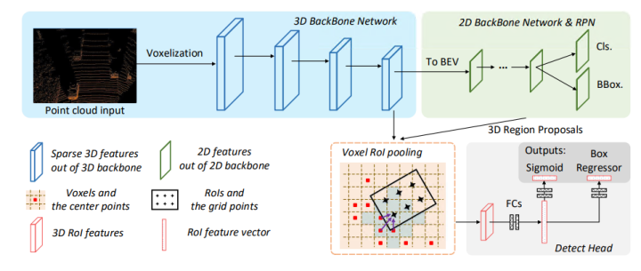

#### [CenterPoint](https://github.com/tianweiy/CenterPoint)

CenterPoint is an extension of the Center-based series of work (CenterNet, CenterTrack, CenterPoint), the author released the first version of CenterPoint in arxiv in 2020, and then further expanded CenterPoint into a two-stage 3D inspection and tracking model, which has better performance and less additional time than single-stage CenterPoint. The main contribution of this paper is to propose a two-stage Center-based object detection tracking model, in which CenterPoint is used to detect the center point of the detection frame of a three-dimensional target in the first stage (a, b, and c in the figure below), and regress its detection box size, direction, and speed. In the second stage (d in the figure below), a refinement module is designed, and for the detection box in the first stage, the point feature in the center of the detection box is used to regress the score of the detection box and refinement. In nuScenes' 3D detection and tracking tasks, the single-stage CenterPoint worked well, with an NDS of 65.5 for a single model and 63.8 for AMOTA. The model performs well, but the paper says that the speed of the model is 11FPS on Waymo and 16FPS on nuScenes; At the same time, the speed experiment of the model is done on TiTan RTX, that is, real-time computing is not achieved on all edge computing devices.

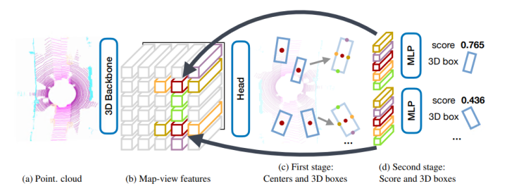

### Based on Point-Voxel

#### [PV-RCNN](https://github.com/topics/pv-rcnn)

The Point-Voxel-based method is a way between point-based and voxel-based. PV-RCNN is the first classic point-based and voxel-based network, and the paper proposes the Voxel Set Abstraction operation, which projects the sparse voxel and its features from multiple scales in the Sparse Convolution backbone network back into the original 3D space, and then uses a small number of keypoints (sampled from the point cloud) as the center of the ball. Aggregate the surrounding voxel-wise features on each scale. This process actually combines the structure of point-based and voxel-based point cloud feature extraction, while aggregating the multi-scale information of the entire scene into a small number of key point features for the next step of RoI-pooling. The paper also proposes the Predicted Keypoint Weighting module, which highlights the characteristics of the foreground key points and weakens the characteristics of the background key points by using the free point cloud segmentation annotation obtained from the 3D annotation box. In addition, the paper also designs a stronger point cloud 3D RoI pooling operation, which is the RoI-grid pooling proposed in the paper: unlike the previous one, each RoI evenly samples some grid points, and then uses the grid point as the center of the ball to aggregate the characteristics of the surrounding keypoints. Through the interaction process of Voxel-to-keypoint and keypoint-to-grid, the structural diversity of PV-RCNN is significantly enhanced, so that it can learn more diverse features from the point cloud data to improve the final 3D detection performance. Using only LiDAR sensors, the algorithm has achieved three runners-up (all unlimited sensor algorithm lists) in the Waymo Open Challenge point cloud challenge in the field of autonomous driving, three first places in the Lidar single-modal algorithm, and the first place in the overall ranking on the KITTI Benchmark for more than half a year.

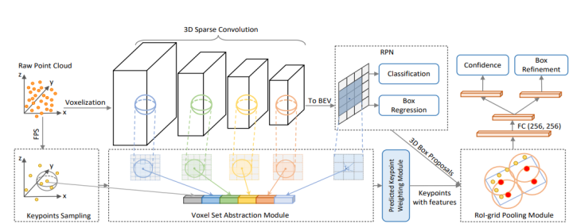

#### [SA-SSD](https://github.com/skyhehe123/SA-SSD)

SA-SSD uses the unique fine regression of the two-stage method on the first-stage detection method, for which the author uses SECOND as the backbone, and adds two additional tasks, so that the backbone has the ability of structure aware, and the positioning is more accurate, as shown in the figure below, the auxiliary head participates in training, and the inference stage can be eliminated!

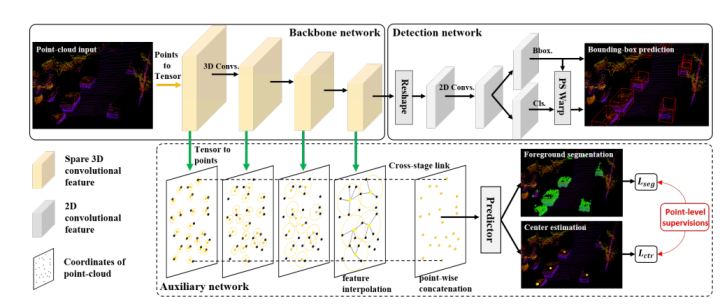

#### [PV-RCNN++](https://github.com/sshaoshuai/PV-RCNN)

PV-RCNN++ proposes a convolutional neural network based on point voxel regions for detecting three-dimensional targets from point clouds. First, the paper proposes a new 3D detector, which includes two steps: voxel-to-keypoint scene encoding and keypoint-to-mesh RoI feature extraction. These two steps deeply integrate the 3D voxel CNN with PointNet-based collection abstraction to extract discriminant features. In addition to this, an advanced framework PV-RCNN++ is proposed for more efficient and accurate 150D object detection. It includes two major improvements: a partitioned proposal-centric strategy for efficiently generating more representative key points; The other is vector pool aggregation, which is used to better aggregate local point features with less resource consumption. With these two strategies, PV-RCNN++ is more than twice as fast as PV-RCNN, while achieving better performance on massive Waymo open datasets with detection ranges of 150m×3m. In addition, the proposed PV-RCNN achieves state-of-the-art <>D inspection performance on both Waymo's open dataset and the highly competitive KITTI benchmark.

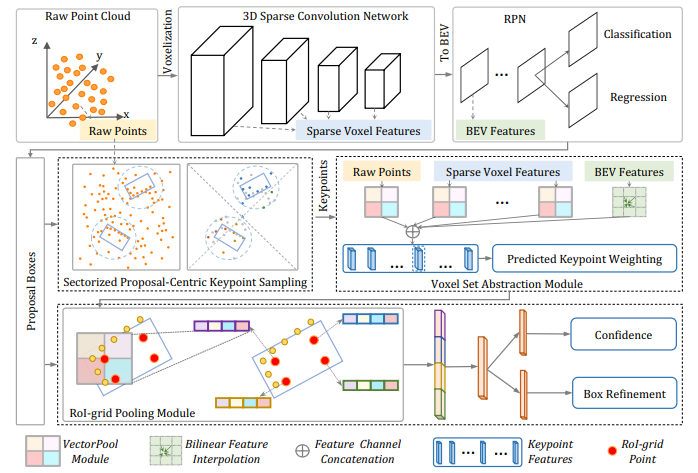